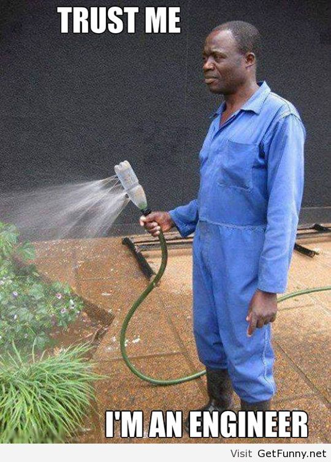
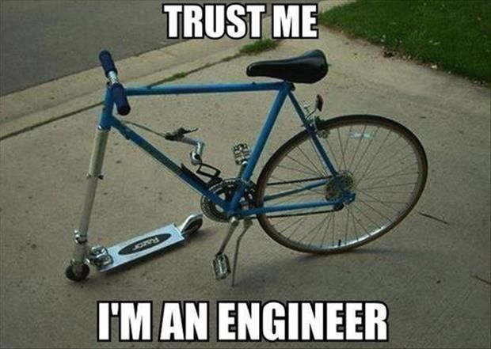
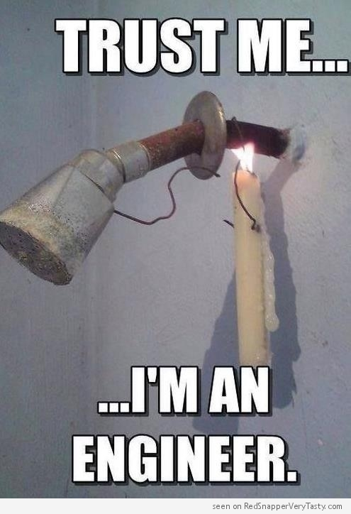
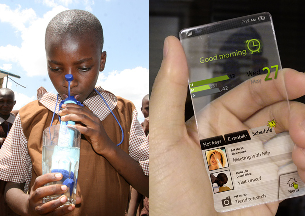
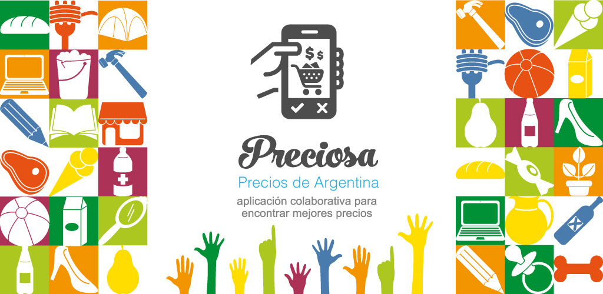
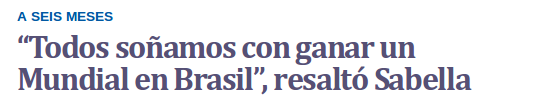
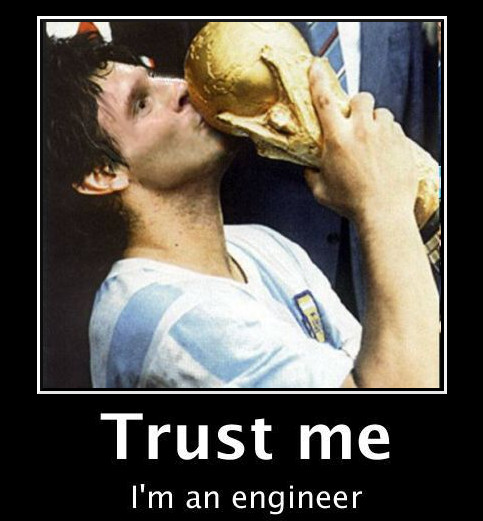

:title: Ingeniería para ganar el mundial
:data-transition-duration: 500
:css: slides.css

-----

:id: portada

********************************************
      Ingeniería para ganar el mundial
********************************************

Una charla para cabuleros
-----------------------------

y futuros ingenieros
-----------------------

.. raw:: html

    
por Martín Gaitán

----

A modo de pedido de disculpas
-----------------------------

.. image:: img/chat.png
   :align: center

----

Esa loca gente creativa
------------------------

.. epigraph::

   Los científicos estudian lo que es. Los ingenieros crean lo que nunca ha sido.

   -- Theodore von Karman

----

:data-rotate-y: 90
:data-y: r-1400

----

------

-----

:data-rotate: 90
:data-y: r-1400

Lo que *nunca* ha sido
--------------------------------

| Crear EBTs a partir de conocimiento especializado
| No era común en Argentina
| Pero ahora **hay condiciones propicias**
|
| Phasety, creada por ingenieros
  **aprendiendo lo que la universidad
  no les enseñó**

----

De paso, bonito el logo ¿no?
+++++++++++++++++++++++++++++

---------

:data-rotate-y: -90
:data-y: 1400

Pero, ¿qué es lo que no se nos enseña(ba)?
------------------------------------------

- Una ingenieria más integral:
  tecnología + $$$ + ambiente + sociedad
- No imaginarse empleado como única posibilidad
- Que la ingenieria no es sólo **saber resolver problemas**

(y sí, a **programar bien**)

-----

Está clarísimo!
---------------

#NOT
----

-------

Los que "resuelven problemas"
-----------------------------

.. epigraph::

    Como profesor siento una responsabilidad: enseñarles a pensar para resolver problemas. Después de todo eso es un ingeniero.

    -- Un profesor que siente responsabilidad

¿Sólo eso es un ingeniero? Ponele:

- Sabemos sacar cuentas y usar (con suerte **crear**) tecnología
- Pero...

-------

Los problemas
-------------

- ¿Cuáles problemas debemos (intentar) resolver?
- ¿Qué tecnologías hacen más falta y están a nuestro alcance?

-----

:data-rotate: -90
:data-y: r1400

Ojo, no hay que ser hippie
---------------------------

No se puede vivir del amor

----

¿Un ejemplo?
------------

----------

La ventaja del software
------------------------

(y la electrónica digital)

-----

Cabeza de ratón vs Cola de león
-------------------------------

¿Emprender o vender la fuerza de trabajo?

+--------+-----------------+---------------------------------------+
|        |    Pros         |    Contras                            |
+--------+-----------------+---------------------------------------+
| cola   | Sueldo seguro   | Poco decidís vos (ni tu jefe)         |
|        | Sólo tecnología | ¿Qué tan seguro es?                   |
|        | Sci-fi enabled  | ¿No querés más que un sueldo?         |
+--------+-----------------+---------------------------------------+
| cabeza | Elegís el qué   | El piso puede ser más bajo            |
|        | Y el cómo       | Quizás no hagas naves espaciales      |
|        | No hay techo    |                                       |
|        | Creas laburo!   | **¡Altas responsabilidades, Batman!** |
+--------+-----------------+---------------------------------------+

---------

Igual, no todo es blanco o negro
--------------------------------

- Podés trabajar en una empresa chica
- Podés ser un especialista y vender servicios/capacitación
- O hacé lo que quieras, pero **sé groso y valorate**

----

Lo importante (IMHO)
---------------------

- Valorar tu libertad profesional
- y tu futuro
- Capacitate para **lo que te gusta**, la facu es sólo un primer paso
- Aprovechá tu PPS y PI
- Y aprendé a programar Python! ;-)

-----

Empresas de base tecnológica
-----------------------------

.. epigraph::

   "EBT son aquellas empresas en las que parte o todo el proceso productivo
   sucede en el cerebro de sus trabajadores."

   -- Dr. Lino Baraño, Ministro de Ciencia y Tecnología.

------

- Es **mucho más fácil** en software y electrónica digital
- Hay **mucha ayuda**: incubadoras, subsidios, prestamos blandos
- Mejor si te juntás con quienes te complementan
- ¡Hay muchos problemas por resolver!
- ¡Mucha satisfacción y plata esperándote!

(Pero **no es para cualquiera**, recorcholis, Batman)

-----------------

:data-rotate-y: 90

Che, a todo esto, ¿la charla no era sobre el mundial?
-------------------------------------------------------

----

Igual... el pibe la tiene clara
----------------------------------

.. epigraph::

   Después de los entrenamientos, programo en Python

   --  Lionel Messi

.. image:: img/messi-ok.jpg
   :align: center

----

Quédense traquis, lo ganamos
----------------------------

--------

******************
Muchas gracias
******************

